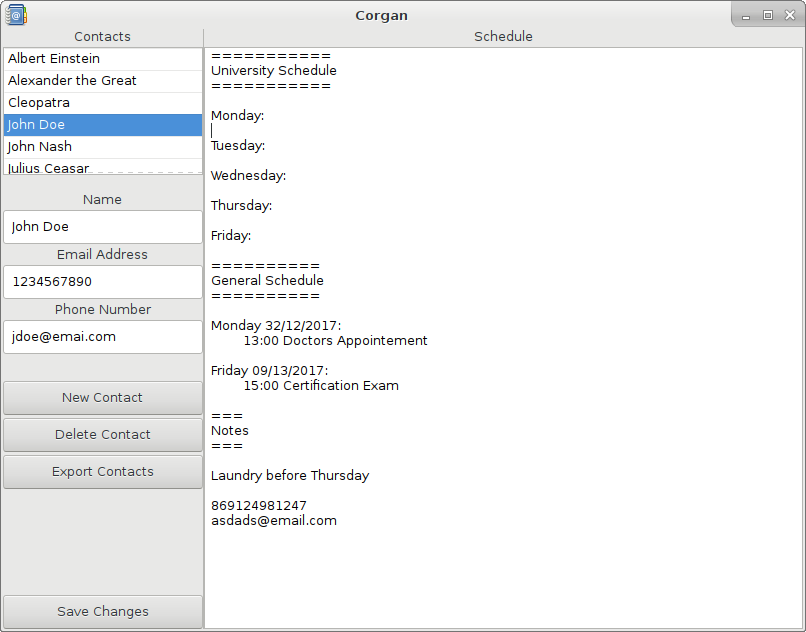

# Corgan

Corgan is a simple contacts and schedule organizer written in C
using the Gtk+3 framework.

You can also automatically export all your contacts, in the
form of a vCard version 3, to the apps directory.

## Build Requirements:
- Autoconf
- Automake
- Gettext
- Autopoint
- GTK3 developement headers

## Build Instructions:
- autoreconf -ivf
- ./configure
- make

To enable debugging run **./configure --enable-debug**.

To execute tests run  **make check**.

## Install Instructions:
- sudo make install

This will install the corgan binary, its desktop file and i18n
files to their respective locations. Your contacts and schedule
data are saved at $XDG\_DATA\_HOME/corgan/ which
is by default ~/.local/share/corgan/.

## Uninstall Instructions:
- sudo make uninstall

While it will remove all files installed by **make install**, your
contacts and schedule data will persist, so you must remove them
manually.
